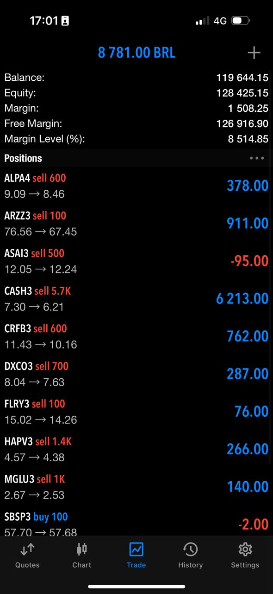
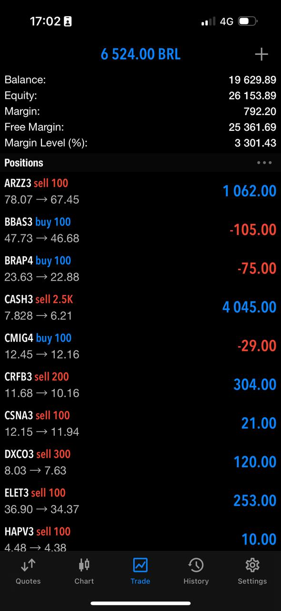

# Estratégia Método Trading Sem Limites

Bem-vindo ao projeto de Estratégia de Automação de Trading. Aqui você encontrará todos os recursos e instruções necessárias para começar a operar e almejar um rendimento de 3 a 5% ao mês utilizando nossa estratégia automatizada.

## Primeiros Passos

### 1. Baixe o Zorro Trader

O primeiro passo é baixar e instalar o Zorro Trader através do [link oficial](https://zorro-project.com/download.php).

### 2. Configure o MetaTrader

Em seguida, você deve configurar o MetaTrader para se conectar ao Zorro Trader. Você pode encontrar um guia detalhado sobre como fazer isso [aqui](https://zorro-project.com/manual/en/mt4plugin.htm).

## Configuração dos Arquivos

Após instalar o Zorro Trader, é necessário mover alguns arquivos para as pastas correspondentes:

- Mova os arquivos `.par` e `.fac` para a pasta `Data` na diretório de instalação do Zorro.
- Coloque o arquivo `bovespa.csv` na pasta `History` no diretório de instalação do Zorro.
- Se você não deseja compilar o projeto, basta colocar o arquivo `Youtube.dll` na pasta `Strategy` no diretório de instalação do Zorro.

## Execução

Com tudo configurado, agora você está pronto para começar:

1. Inicie o Zorro Trader.
2. Deixe o sistema rodar 24/7. É importante não desligar o PC e idealmente executar o software em uma VPS para garantir a operação contínua.

> **Nota:** A estratégia opera no gráfico diário, então é crucial manter o robô em execução 24 horas por dia.

## Resultados

Confira os resultados das nossas operações nos últimos dois meses em duas contas diferentes:

*Inserir descrição detalhada dos resultados aqui.*

## Curso

Se você deseja aprofundar seus conhecimentos e explorar todas as funcionalidades e potenciais da estratégia, recomendamos nosso curso completo disponível no [link](https://www.leohermoso.com.br/).

---

Obrigado por escolher a nossa estratégia de automação de trading. Desejamos a você sucesso em suas operações!
